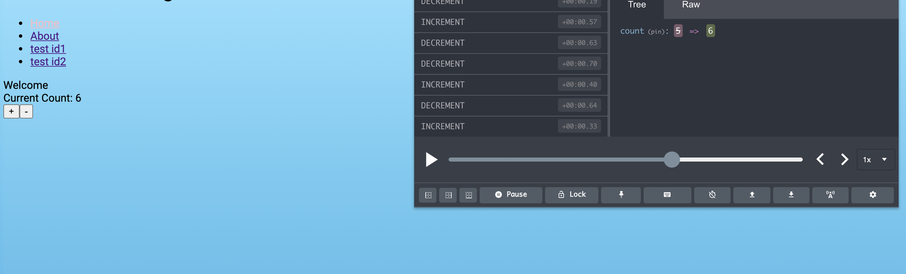

<<<<<<< HEAD
# Title

*description*

[deployed url](http://url-if-deployed-here)

## What Worked Well

## What Didn't

## Extra Credit

## Screenshots
=======
# Starterpack - with Redux

Adding Redux to my starterpack.

[deployed url](https://confident-davinci-91dfdf.netlify.app/)

## What Worked Well

Getting the counter to work and examining the state with redux dev tools

## What Didn't

Understanding redux. It feels complex and strange, but will likely become much more familiar with lab 4.

## Screenshots

>>>>>>> 87bdcb87684f8bb2d0b9200c7e6e2db2b330cc94
