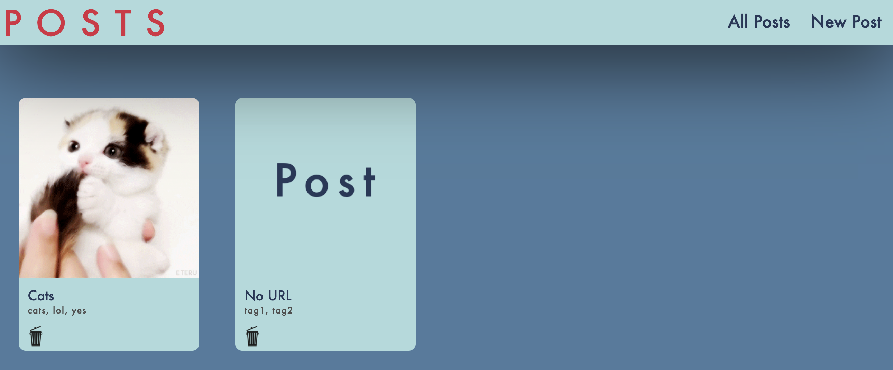
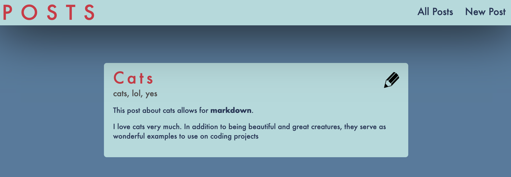

# React/Redux Posting

In this lab, we expand on our react notes lab and go much further by using redux to allow users to make and view posts. What I noticed is that while confusing at first, Redux allows us to easily access information across many components.

[deployed url](https://redux-notes.netlify.app/)

## What Worked Well

What worked well was my ability to easily create and pass data between new components one the actions and reducers were coded. The redux state allowed me to do this with ~relative~ ease.

## What Didn't

What didn't work so well was the asynchronous nature of the API calls. I would perform some action, and when I expected to see a result, there wasn't one because the API call hadn't finished before the results were displayed. This happened in a number of places and required a relatively unique workaround in each case.

## Extra Credit

I did 2 things for extra credit:

1) Alerting the user if they don't fill out the title and content fields when making a new post

2) added a filler image (sort of a default) for when a user decides not to enter a cover image url to improve UI and make it look less clunky

## Screenshots

